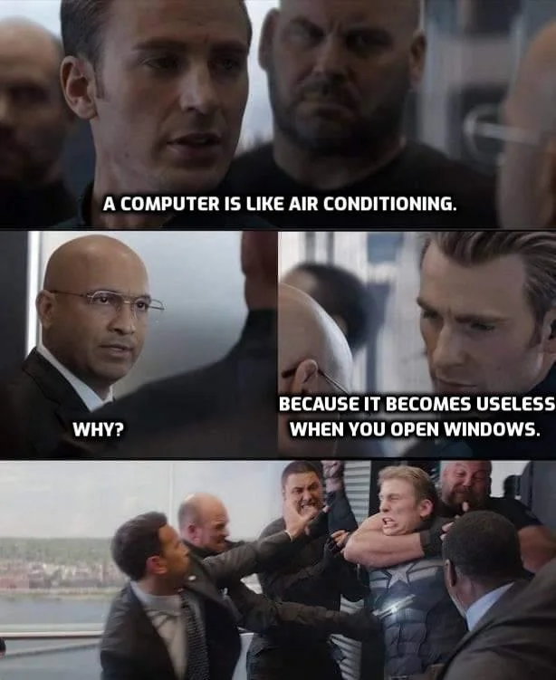

# Not sure if you want a title here but whatever

Link to an article: [How Can We Standardize Git Commits?](https://www.alibabacloud.com/blog/597372)

## Why this matters

> ~~Maybe it doesn't~~

This is my personal favorite for formatting ``commit messages``. I have used this standard for the past hundreds of commits or so across some of my past projects and it has turned out to be **clean** and **concise**.

And just to make this page look "pretty" per homework requirement:

